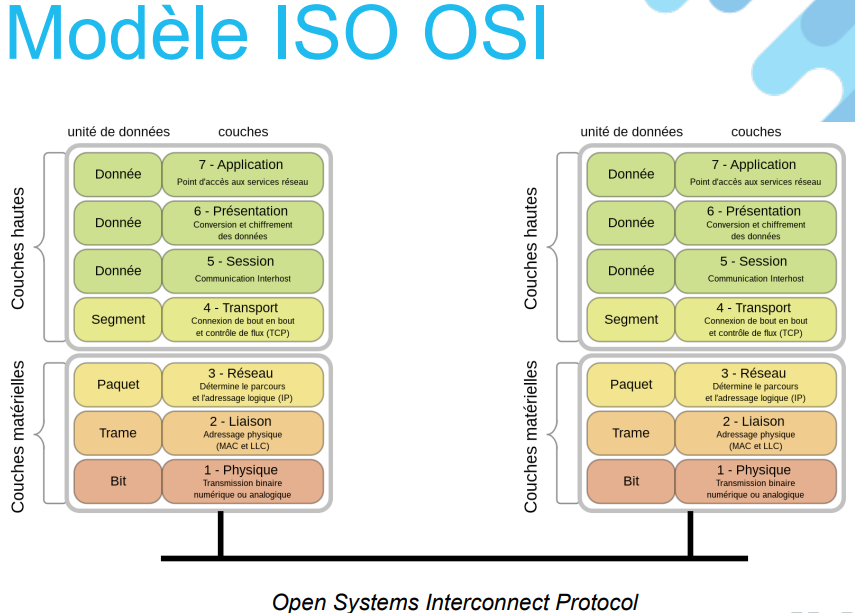
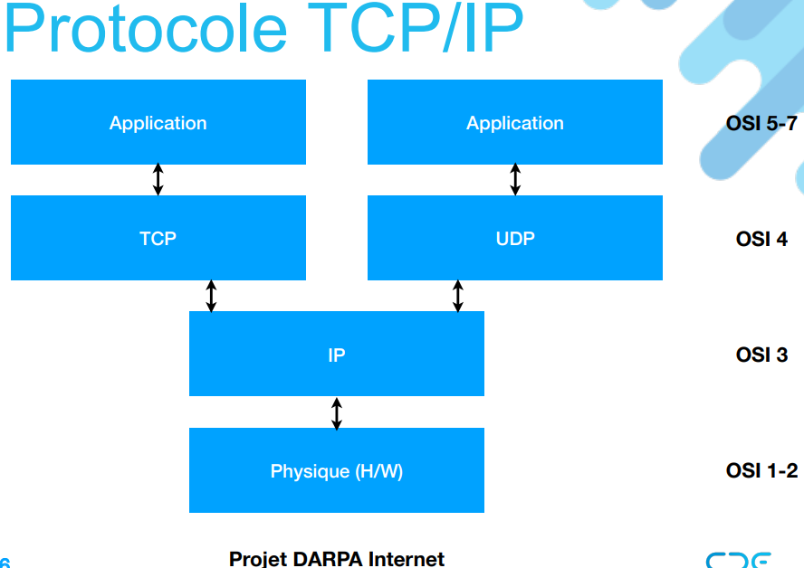

### 1. **Objectifs du Cours**
   - **Programmation Client-Serveur** : Apprendre à créer des applications réseau en utilisant des sockets.
   - **Communication par Sockets** : Maîtriser l'envoi et la réception de messages.
   - **Systèmes Distribués** : Comprendre la coordination entre processus distribués et les algorithmes de consensus (Raft, Paxos, etc.).
   - **DHT et Routage** : Comprendre et implémenter des tables de hachage distribuées (DHT) et des algorithmes de routage (ex. Chord, Kademlia).

### 2. **Concepts de Base en Programmation Réseau**
   - **Modèles OSI et TCP/IP** : Comprendre la couche application, transport (TCP, UDP), Internet (IP), et réseau physique.

   - **Types de Connexion** :
     - **Connecté (TCP)** : Maintient une connexion ouverte (ex : session TCP).
     - **Sans Connexion (UDP)** : Envoie des messages indépendants, utile pour les transmissions rapides.
   - **Encapsulation des Paquets** : Les paquets de données incluent des en-têtes à chaque couche pour acheminer les données.

### 3. **Modèles de Communication**
   - **Passage de Messages** : Envoi direct de données entre processus.
   - **Appel de Procédures Distantes (RPC)** : Permet à un programme d'appeler une fonction située sur une autre machine.
   - **Publish/Subscribe** : Les processus publient et reçoivent des messages en fonction de sujets spécifiques.

### 4. **Architecture de Systèmes Distribués**
   - **Topologies de Réseau** : Anneaux, étoiles, hypercubes, et arbres pour structurer les communications.
   - **Paramètres des Graphes** :
     - **Degré** : Nombre de voisins directs d'un nœud.
     - **Diamètre** : Plus longue distance entre deux nœuds.
   - **Tolérance aux Pannes** : Importance d’un système distribué fiable, capable de gérer les pannes de nœuds ou de réseau.

### 5. **Algorithmes de Consensus**
   - **RAFT** :
     - **Leader** : Gère les décisions et la synchronisation des autres nœuds (Followers).
     - **Élections** : Si le leader échoue, les nœuds organisent une élection pour choisir un nouveau leader.
     - **Log Replication** : Le leader assure que tous les nœuds suivent le même journal pour garantir la cohérence des données.
   - **Autres Algorithmes** : Paxos, ZAB, Chubby pour la coordination des données.

### 6. **Tables de Hachage Distribuées (DHT)**
   - **But** : Permettre le stockage et la recherche de données réparties entre plusieurs nœuds sans serveur central.
   - **Fonction de Hachage** : Associe chaque donnée à un identifiant unique, stocké sur le nœud le plus proche de cet identifiant.
   - **Algorithmes de Routage** : Utilisation de Chord ou Kademlia pour trouver le nœud qui possède les données demandées en un nombre minimal de sauts.

### 7. **Modèles de Calcul Distribué**
   - **Client-Serveur** : Un client interagit avec un serveur central.
   - **Pair-à-Pair (P2P)** : Les nœuds partagent des ressources directement sans passer par un serveur central.
   - **Modèles de Communication** :
     - **Synchrone** : Le client attend une réponse.
     - **Asynchrone** : Le client continue son exécution en attendant la réponse.

### 8. **Problèmes dans les Systèmes Distribués**
   - **Défaillances** : Gestion des pannes au niveau des clients, du réseau, et des serveurs.
   - **Coût de Communication** : Les communications ne sont pas gratuites en termes de temps et de ressources.
   - **Synchronisation et Coordination** : Assurer la cohérence des données entre nœuds distribués.
   - **Localité et Latence** : Minimiser les temps de réponse en privilégiant la proximité géographique ou logique des nœuds.

### 9. **Illusions dans les Systèmes Distribués**
   - Le réseau est fiable, la latence est nulle, la bande passante est infinie, etc. Ce sont des présuppositions souvent fausses dans la réalité d'un système distribué.

---
